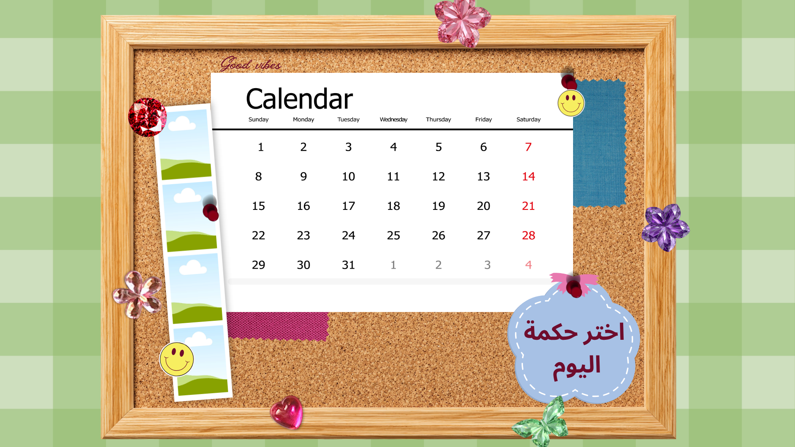

# ترتيبة · Tartiba

A cozy corkboard calendar and task planner for Windows, with a desktop widget.
تقويم على لوحة فلّين ومخطط مهام لويندوز، مع ودجت على سطح المكتب.



## Features · المميزات

- **Calendar** — Gregorian and Hijri (Umm al-Qura) dates together, pick any month and year, Fridays and Saturdays in red, a pencil circle around days with unfinished tasks and a green tick above days where everything is done.
- **Tasks** — click any day to add tasks, optional countdown timer per task, tick to cross out. Everything is saved on your computer until you delete it.
- **Timer sound** — classic alarm clock by default; pick any song or sound file from your computer in Settings.
- **Photo strip** — four photos you can change anytime.
- **Daily quote** — write seven quotes, one per weekday; the cloud shows today's automatically.
- **Themes** — 6 pastel and 5 dark themes.
- **Arabic / English** — the whole layout flips right-to-left in Arabic.
- **Desktop widget** — today's tasks in a small window you can move and resize; tick tasks and start/pause timers from it; pin button to keep it above or behind other windows; optional "open when Windows starts".

## Run it · طريقة التشغيل

1. Install **Node.js LTS** from <https://nodejs.org> (one time only).
2. Open this folder, click the address bar, type `cmd` and press Enter.
3. Run:

   ```
   npm install
   npm start
   ```

`npm install` is only needed the first time.

## Build an installer · بناء ملف التثبيت

```
npm run dist
```

The installer (`Tartiba Setup 1.0.0.exe`) and a portable version appear in the `dist` folder.

## Where your data lives

`%APPDATA%\Tartiba\tartiba-data.json` (tasks, quotes, settings). Photos and your chosen timer sound are copied into the same folder, so moving or deleting the originals doesn't break anything.

## Project layout

```
src/main.js          app windows, saving, timers, tray, widget, start-with-Windows
src/store.js         all data changes (tested in test/store.test.js)
src/renderer/        calendar, tasks and settings screens
src/widget/          the desktop widget
src/shared/          languages, themes, Hijri dates, shared helpers
assets/              board image, fonts, alarm sound, icon
tools/               scripts that generated the assets from the designs
```

## Credits

- Fonts: [Cairo](https://github.com/Gue3bara/Cairo) and [DSEG7](https://github.com/keshikan/DSEG), both under the SIL Open Font License (see `assets/fonts/`).
- The alarm sound and app icon were generated for this project (`tools/make_sound_and_icon.py`).
